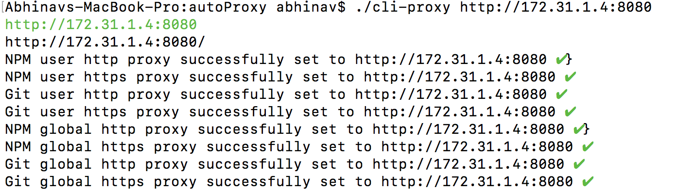

# Proxy Manager


## Set Up

* Clone the repository or download the zip.
* Go to the autoProxy directory
* Execute 
```bash 
chmod u+x cli-proxy
```
* Set up is finished !
## Usage

Navigate to the autoProxy directory and use 
```bash 
./cli-proxy '<your proxy>'
```

Example
```bash
./cli-proxy 'http://172.31.1.4:8080'
```

```bash
./cli-proxy reset
```
## Sample output

**Setting up proxies:**




**Resetting Proxies**


### Currently changes proxy for:
* npm
* git
